# EX-05-Feature-Generation


## AIM
To read the given data and perform Feature Generation process and save the data to a file. 

# Explanation
Feature Generation (also known as feature construction, feature extraction or feature engineering) is the process of transforming features into new features that better relate to the target.
 

# ALGORITHM
### STEP 1
Read the given Data
### STEP 2
Clean the Data Set using Data Cleaning Process
### STEP 3
Apply Feature Generation techniques to all the feature of the data set
### STEP 4
Save the data to the file


# CODE
## DATA.csv 
```
import pandas as pd
df=pd.read_csv("data.csv")
df
from sklearn.preprocessing import LabelEncoder,OrdinalEncoder
temp=["Cold","Warm","Hot","Very Hot"]
enc=OrdinalEncoder(categories=[temp])
df["Ord_1"]=enc.fit_transform(df[["Ord_1"]])
df
education=["High School","Diploma","Bachelors","Masters","PhD"]
ed=OrdinalEncoder(categories=[education])
df["Ord_2"]=ed.fit_transform(df[["Ord_2"]])
df
pip install category_encoders
from category_encoders import BinaryEncoder
be=BinaryEncoder()
ndf=be.fit_transform(df["bin_1"])
ndf
df["bin_1"]=ndf["bin_1_0"]
df
be1=BinaryEncoder()
ndf1=be1.fit_transform(df["bin_2"])
ndf1
df["bin_2"]=ndf1["bin_2_0"]
df
from sklearn.preprocessing import OneHotEncoder
ohe=OneHotEncoder(sparse=False)
ohe.fit_transform(df[["City"]])
from category_encoders import TargetEncoder
te=TargetEncoder()
te.fit_transform(X=df['Ord_1'],y=df["Target"])
le=LabelEncoder()
df["City"]=le.fit_transform(df[["City"]])
df
from sklearn.preprocessing import StandardScaler
sc=StandardScaler()
df1=pd.DataFrame(sc.fit_transform(df),columns=['id','bin_1','bin_2','City','Ord_1','Ord_2','Target'])
df1
from sklearn.preprocessing import MaxAbsScaler
mas=MaxAbsScaler()
df2=pd.DataFrame(mas.fit_transform(df),columns=['id','bin_1','bin_2','City','Ord_1','Ord_2','Target'])
df2
from sklearn.preprocessing import MinMaxScaler
mms=MinMaxScaler()
df3=pd.DataFrame(mms.fit_transform(df),columns=['id','bin_1','bin_2','City','Ord_1','Ord_2','Target'])
df3
from sklearn.preprocessing import RobustScaler
rs=RobustScaler()
df4=pd.DataFrame(rs.fit_transform(df),columns=['id','bin_1','bin_2','City','Ord_1','Ord_2','Target'])
df4
```
## ENCODING.csv
```
import pandas as pd
df=pd.read_csv("Encoding Data.csv")
df
from sklearn.preprocessing import LabelEncoder,OrdinalEncoder
temp=["Cold","Warm","Hot"]
enc=OrdinalEncoder(categories=[temp])
df["ord_2"]=enc.fit_transform(df[["ord_2"]])
df
from category_encoders import BinaryEncoder
be=BinaryEncoder()
ndf=be.fit_transform(df[['bin_1']])
ndf
df["bin_1"]=ndf["bin_1_0"]
df
be1=BinaryEncoder()
ndf1=be1.fit_transform(df[['bin_2']])
ndf1
df["bin_2"]=ndf1["bin_2_0"]
df
from sklearn.preprocessing import OneHotEncoder
ohe=OneHotEncoder(sparse=False)
ohe.fit_transform(df[["nom_0"]])
le=LabelEncoder()
df["nom_0"]=le.fit_transform(df[["nom_0"]])
df
from sklearn.preprocessing import StandardScaler
sc=StandardScaler()
df1=pd.DataFrame(sc.fit_transform(df),columns=['id','bin_1','bin_2','nom_0','Ord_2'])
df1
from sklearn.preprocessing import MinMaxScaler
mms=MinMaxScaler()
df2=pd.DataFrame(mms.fit_transform(df),columns=['id','bin_1','bin_2','nom_0','Ord_2'])
df2
from sklearn.preprocessing import MaxAbsScaler 
mas=MaxAbsScaler()
df3=pd.DataFrame(mas.fit_transform(df),columns=['id','bin_1','bin_2','nom_0','Ord_2'])
df3
from sklearn.preprocessing import RobustScaler
rs=RobustScaler()
df4=pd.DataFrame(rs.fit_transform(df),columns=['id','bin_1','bin_2','nom_0','Ord_2'])
df4
```
## TITANIC.csv
```
import pandas as pd
df=pd.read_csv("titanic_dataset.csv")
df
df.isnull().sum()
df["Age"]=df["Age"].fillna(df["Age"].median())
df["Embarked"]=df["Embarked"].fillna(df["Embarked"].mode()[0])
df
df.drop("Cabin",axis=1,inplace=True)
df.drop("Ticket",axis=1,inplace=True)
df.drop("Name",axis=1,inplace=True)
df.isnull().sum()
df
from sklearn.preprocessing import LabelEncoder,OrdinalEncoder
embark=["C","S","Q"]
emb=OrdinalEncoder(categories=[embark])
df["Embarked"]=emb.fit_transform(df[["Embarked"]])
df
from category_encoders import BinaryEncoder
be=BinaryEncoder()
ndf=be.fit_transform(df[["Sex"]])
ndf
df["Sex"]=ndf["Sex_0"]
df
from sklearn.preprocessing import StandardScaler
ss=StandardScaler()
df1=pd.DataFrame(ss.fit_transform(df),columns=['Passenger','Survived','Pclass','Sex','Age','SibSp','Parch','Fare','Embarked'])
df1
from sklearn.preprocessing import MinMaxScaler
mms=MinMaxScaler()
df2=pd.DataFrame(mms.fit_transform(df),columns=['Passenger','Survived','Pclass','Sex','Age','SibSp','Parch','Fare','Embarked'])
df2
from sklearn.preprocessing import MaxAbsScaler
mas=MaxAbsScaler()
df3=pd.DataFrame(mas.fit_transform(df),columns=['Passenger','Survived','Pclass','Sex','Age','SibSp','Parch','Fare','Embarked'])
df3
from sklearn.preprocessing import RobustScaler
rs = RobustScaler()
df4=pd.DataFrame(rs.fit_transform(df),columns=['Passenger','Survived','Pclass','Sex','Age','SibSp','Parch','Fare','Embarked'])
df4
```
# OUPUT
## DATA.csv
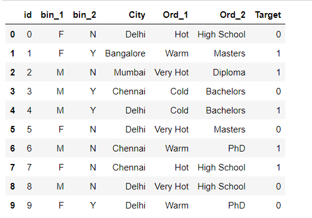

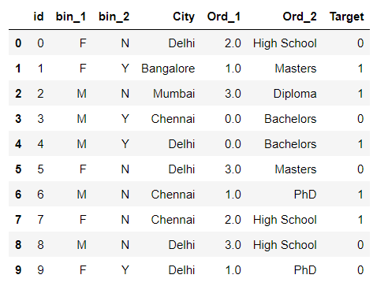

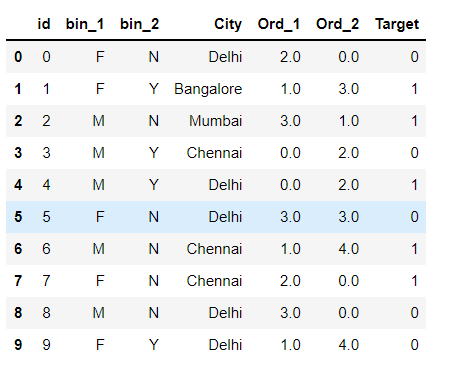

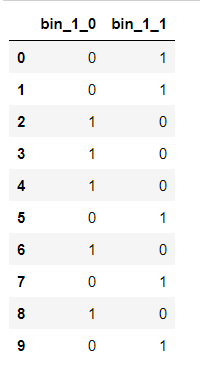

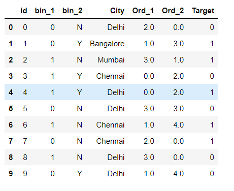

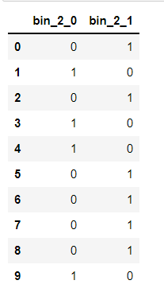

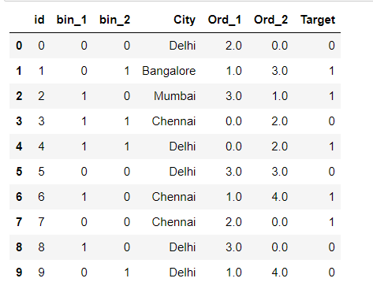

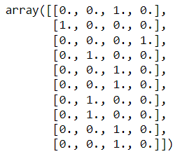

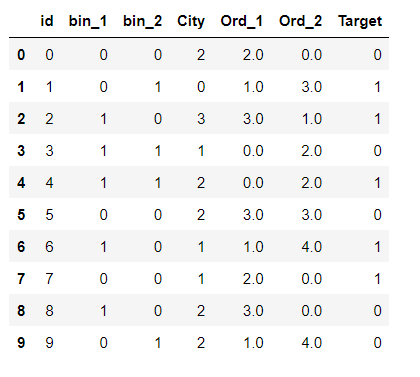

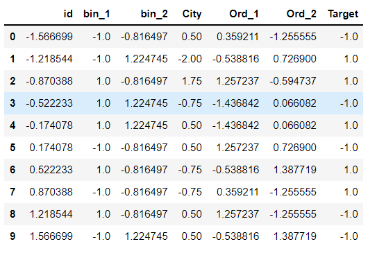

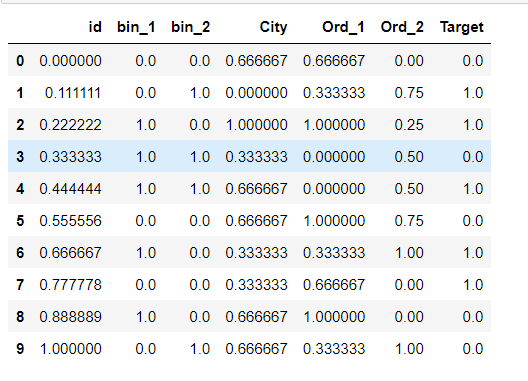

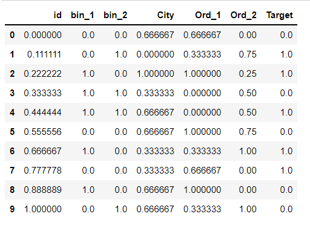

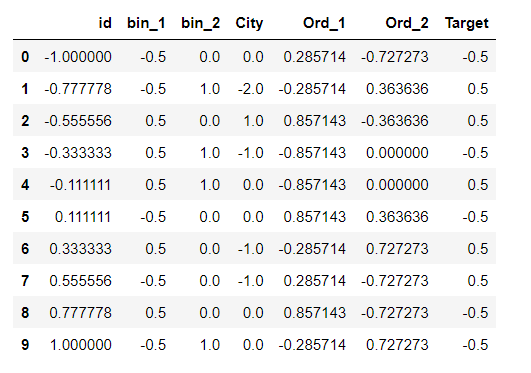

## ENCODING.csv

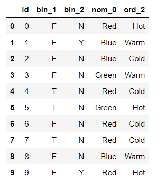

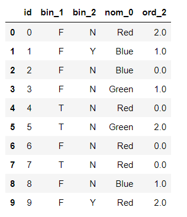

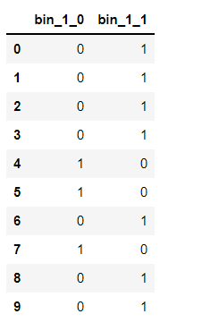

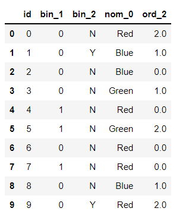

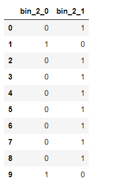

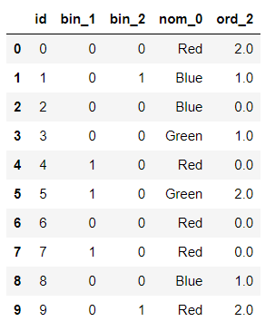

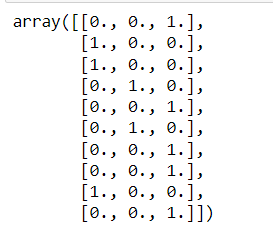

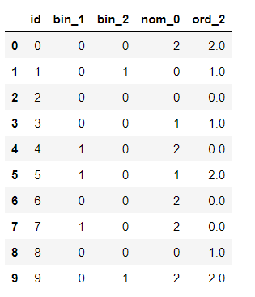

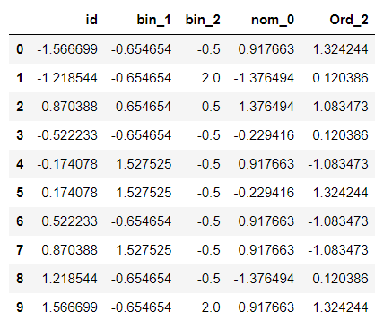

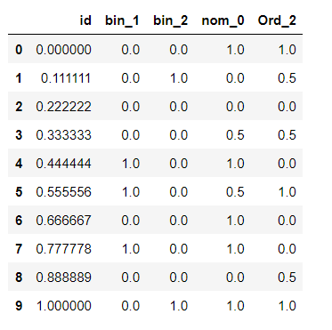

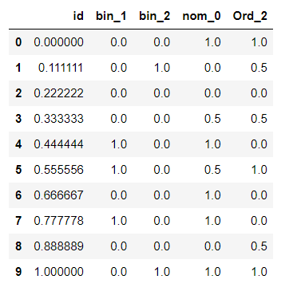

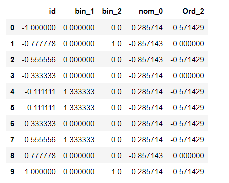

## TITANIC.csv

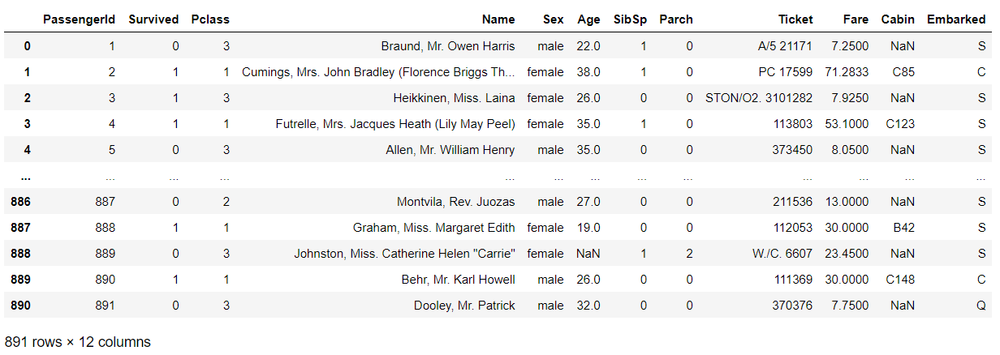

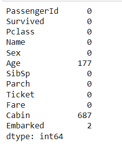

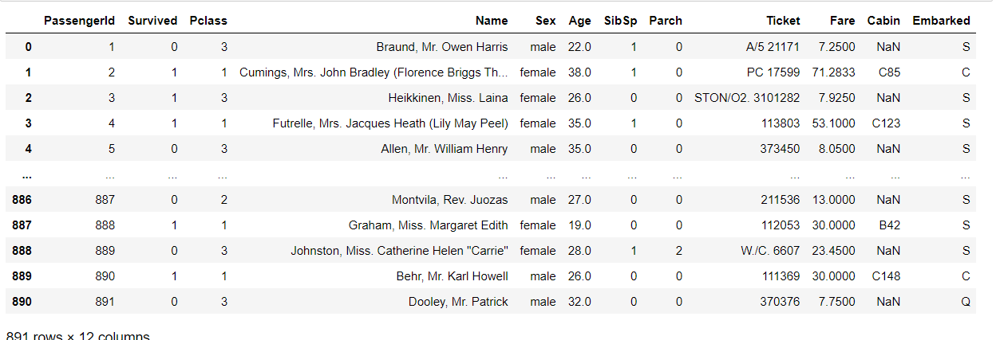

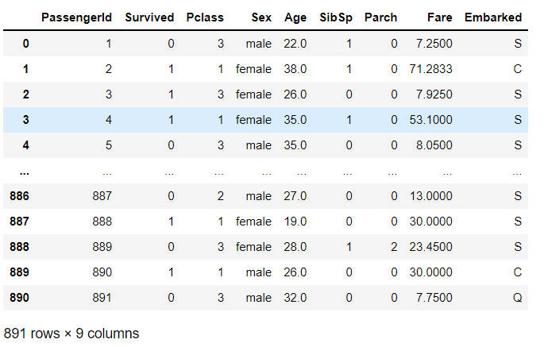

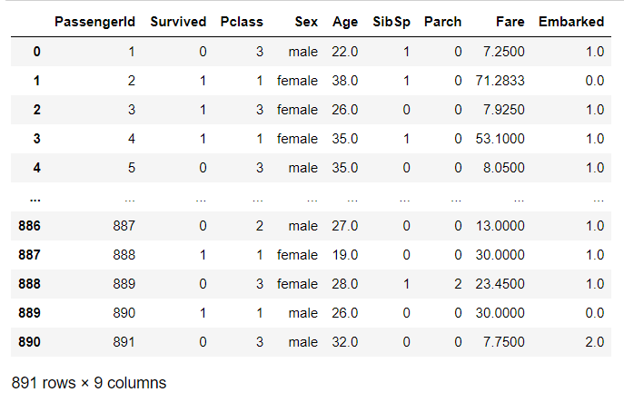

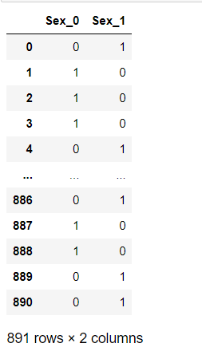

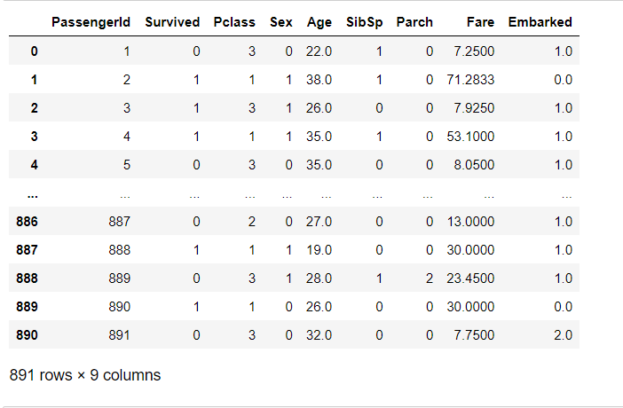

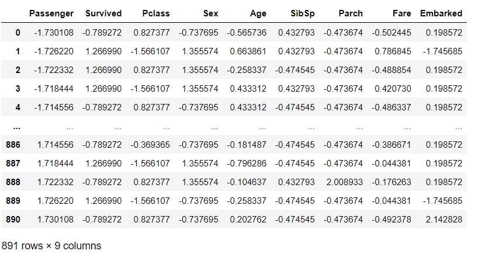

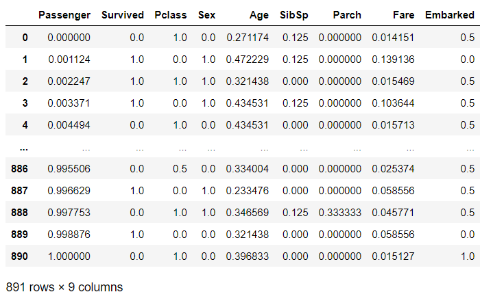

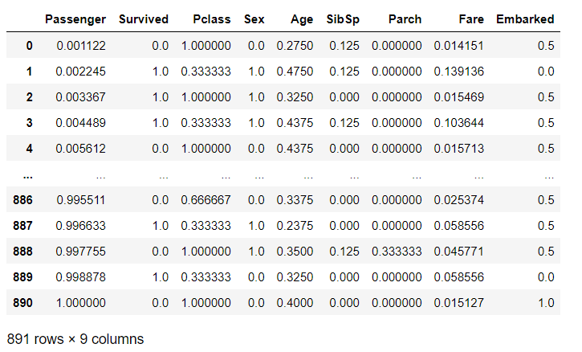

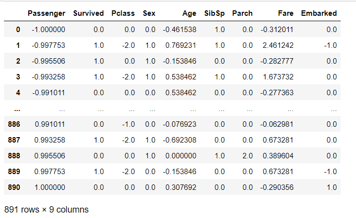

# RESULT:
Feature Encoding process and Feature Scaling process is applied to the given data frame sucessfully.